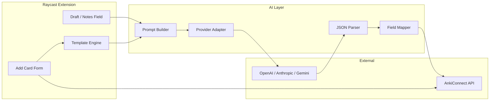

# anki-ai-raycast

A Raycast extension that connects to Anki and uses LLMs to generate high-quality flashcards. I built this to speed up my interview prep workflow — I was creating 50–100 cards/day across DSA, system design, LeetCode patterns, and behavioral questions, and the manual process was the bottleneck, not the studying.

The extension talks to Anki via [AnkiConnect](https://foosoft.net/projects/anki-connect/), supports OpenAI, Anthropic, and Google Gemini as AI backends, and handles both Basic and Cloze note types with structured output parsing and runtime model validation.

> Forked from the [Anki extension](https://github.com/raycast/extensions/tree/main/extensions/anki) in the Raycast community extensions repo. Original work by [anton-suprun](https://github.com/anton-suprun).

## Why I built this

During my interview prep, I was spending more time formatting flashcards than actually learning the material. I needed something that could:

- Turn rough notes from [hellointerview.com](https://hellointerview.com) into properly structured Anki cards without leaving Raycast
- Enforce consistent card formats across five different study areas (DSA concepts, system design, LeetCode patterns, case studies, behavioral stories)
- Intelligently pick between Basic and Cloze note types — cloze for definitions where hiding a key term helps recall, basic for Q&A and tradeoff discussions
- Work with any LLM provider so I'm not locked into one API

The result is a provider-agnostic AI layer that generates cards through structured prompts, parses strict JSON responses, and maps the output to actual Anki model fields — all validated at runtime against whatever note types exist in your collection.

## Architecture



## How the AI layer works

This was the most interesting part to build. The AI isn't just a "send text, get card" wrapper — it's a pipeline with several stages, each handling a specific concern.

### Provider abstraction

Each LLM provider (OpenAI, Anthropic, Gemini) has a different API shape — different auth headers, different request/response schemas, different ways of specifying system prompts. I wrote a thin adapter for each one (`src/ai/providers/`) behind a common interface:

```typescript
interface AIProviderAdapter {
  generate(messages: Message[], settings: AISettings): Promise<string>;
}
```

The orchestrator in `src/ai/index.ts` dispatches to the right provider based on a preference dropdown. No SDK dependencies — each adapter uses native `fetch`, keeping the bundle small.

### Prompt engineering

The system prompt (`src/ai/prompt.ts`) encodes domain knowledge about five card types and their expected structure. When a template is selected, the prompt includes the template's field mapping and tag conventions. The note type selection rules are baked into the prompt too:

- **Cloze** for factual statements where hiding 1–2 key terms forces active recall
- **Basic** for questions, tradeoff discussions, and pattern-to-signals mappings
- LeetCode cards always default to Basic (pattern name + approach, never full code)
- Behavioral cards always default to Basic (STAR format)

The prompt requests strict JSON output with a defined schema — no prose allowed outside the JSON object.

### Structured output parsing

LLMs don't always return clean JSON. The parser (`src/ai/parser.ts`) handles three extraction strategies:
1. Clean JSON (starts with `{`)
2. JSON inside a fenced code block (` ```json ... ``` `)
3. JSON buried in surrounding prose (find first `{` to last `}`)

After extraction, it validates the schema — checking that `selectedNoteType` is a valid enum, cards have the right shape, tags are string arrays — and falls back to sensible defaults for missing fields.

### Basic vs. Cloze field mapping

This was the trickiest part. Anki's Basic and Cloze models have completely different field structures (`Front`/`Back` vs. `Text`), and users can rename these fields or create custom models. The field mapper (`src/ai/fieldMapper.ts`):

1. Checks if the target model exists in the user's Anki collection
2. Validates model type (Cloze models must have `type === 1` in AnkiConnect)
3. Maps AI output fields to Anki model fields by convention (Front/Back for Basic, Text for Cloze)
4. Falls back to positional mapping if field names don't match (first field = front, second = back)
5. If cloze is requested but no cloze model exists, strips the `{{c1::...}}` syntax and falls back to Basic

All of this runs against live model data from AnkiConnect, so it adapts to whatever note types the user has set up.

### Guardrails

- Cards flagged with `NEEDS_REVIEW` when the AI is uncertain about factual content
- LeetCode cards explicitly blocked from including full code solutions
- Atomic cards preferred over dense ones — the AI will split a broad card into multiple focused ones
- Max cloze deletions per card is configurable (default: 2) to prevent overloaded cloze notes

## Features

- **5 card templates** with auto-tagging and field hints for interview prep workflows
- **AI actions**: autocomplete from draft, improve/atomicize, convert between Basic and Cloze, batch-generate from notes
- **Provider choice**: OpenAI, Anthropic, or Gemini — swap anytime via preferences
- **Dry run mode**: preview AI output without writing to Anki
- **Generate Cards from Notes**: separate command for batch generation with a review list
- **QoL shortcuts**: swap front/back, normalize formatting, clipboard helpers, keep template on re-add
- **Remembered defaults**: last-used deck and model persist across sessions
- **Attachment toggle**: file pickers hidden by default to reduce form clutter

## Getting started

1. Install [Anki](https://apps.ankiweb.net/) and the [AnkiConnect add-on](https://ankiweb.net/shared/info/2055492159) (restart Anki after)
2. Clone this repo and run `npm install && npm run dev` in Raycast
3. Open Raycast, search for "Add Card" or "Generate Cards from Notes"
4. (Optional) Enable AI in Raycast Preferences → Anki → Enable AI Assist, then set your provider and API key

## Running tests

```bash
npm test        # run all 73 tests
npm run test:watch  # watch mode
```

Tests cover the AI parser, field mapper, prompt builder, template system, and utility functions, plus integration tests for the full parse → map pipeline with mock API responses.

<details>
<summary><strong>Configuration reference</strong></summary>

### Extension preferences

| Setting | Description |
|---------|-------------|
| AnkiConnect port | Default: 8765 |
| Default Deck / Note Type | Pre-select when adding cards |
| Default Tags | Comma-separated, auto-applied |

### AI preferences

| Setting | Description |
|---------|-------------|
| Enable AI Assist | Toggle AI actions on/off |
| AI Provider | OpenAI, Anthropic, or Gemini |
| AI API Key | Stored as a Raycast password field |
| AI Model | Leave blank for provider default (gpt-4o-mini / claude-sonnet-4-20250514 / gemini-2.0-flash) |
| Note Type Mode | Auto (AI chooses), Prefer Basic, Prefer Cloze, Basic only, Cloze only |
| Max Clozes per Card | Default: 2 |
| Dry Run | Preview without writing |
| Basic / Cloze Model Name | Map to your actual Anki note type names |

### Add Card preferences

| Setting | Description |
|---------|-------------|
| Enable file attachments | Show file pickers (default: off) |
| Show field hints | Template-specific labels |
| Show Draft/Notes field | Multiline input for AI |

</details>

## Keyboard shortcuts

| Shortcut | Action |
|----------|--------|
| `Cmd+Shift+Enter` | Add card, keep template & tags |
| `Cmd+X` | Clear form |
| `Cmd+Shift+S` | Swap front/back |
| `Cmd+Shift+N` | Normalize formatting |
| `Ctrl+A` | AI: Autocomplete from draft |
| `Ctrl+I` | AI: Improve / atomicize |
| `Ctrl+B` | AI: Convert to best note type |

## What I learned building this

- **Structured output from LLMs is fragile.** Even with explicit JSON schemas in the prompt, models occasionally wrap responses in markdown fences or add prose. Building a multi-strategy parser with graceful fallbacks was essential.
- **The adapter pattern pays off fast** when you're integrating multiple APIs with similar semantics but different wire formats. Adding a new provider is ~40 lines.
- **Runtime validation against external systems** (in this case, Anki's model schema) catches mismatches that static types can't. The field mapper needs to handle whatever note types the user has — not just the ones I expected.
- **Prompt engineering is the real product work.** Getting the AI to consistently produce atomic, well-formatted cards across five different study domains took more iteration than writing the TypeScript.

## License

MIT — see [LICENSE](LICENSE) for details.

This project is a fork of the [Anki extension](https://github.com/raycast/extensions/tree/main/extensions/anki) from the Raycast Extensions repository. Original extension by anton-suprun, licensed under MIT.
